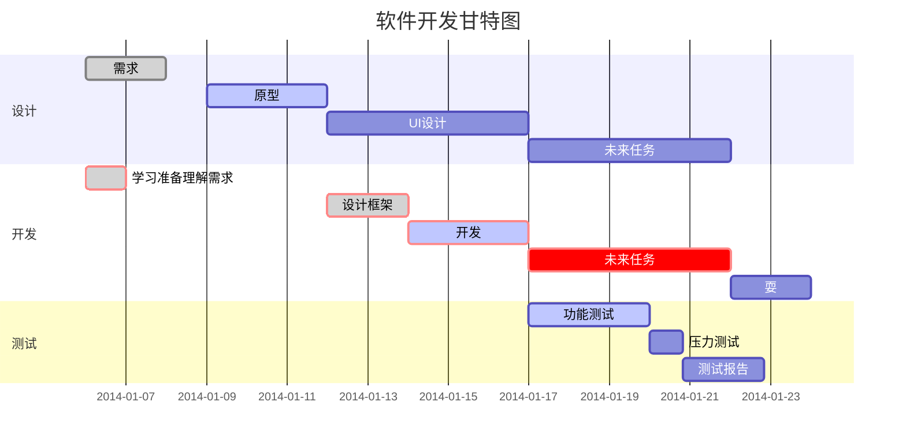

# 30Days Make OS
## Day_01
### main tips
1. DB `“data byte”` 向文件里写一个字节的数据。

2. DW`“data byte”` 向文件里写两个字节的数据。

3. DD `“data byte”` 向文件里写四个字节的数据。

4. RESB `“reserve byte”`按字节预约地址空间，nask会将预约的地址自动填入0x00内容。

5. 此例中，`“binary file”`采用高高低低存储方式。

6. `“RESB	0x1fe-$”`中，$的意义为之前所有输出的字节数（汇编自动计算）。

7. `FAT12格式`，用windows格式化出来的盘的格式，兼容性好。

8. `启动区`，盘的第一个扇区称为启动区，计算机读写磁盘是一个读取一个扇区（512B）,首先从第一个扇区取出内容，然后检查这个扇区的最后两个字节是否为55AA（H），是的话则认定这个扇区开头的是启动程序，并执行。

9. `IPL initial program loader` ，启动区只有512字节，几乎所有的操作系统都是把加载操作系统本身的程序放在启动区里的。
10. `bootstrap!`

```python
import tensorflow as tf
```

`hua`
使用 <kbd>Ctrl</kbd>+<kbd>Alt</kbd>+<kbd>Del</kbd> 重启电脑
$$
\mathbf{V}_1 \times \mathbf{V}_2 =  \begin{vmatrix} 
\mathbf{i} & \mathbf{j} & \mathbf{k} \\
\frac{\partial X}{\partial u} &  \frac{\partial Y}{\partial u} & 0 \\
\frac{\partial X}{\partial v} &  \frac{\partial Y}{\partial v} & 0 \\
\end{vmatrix}
$$tep1}{\style{visibility:hidden}{(x+1)(x+1)}}
$$
